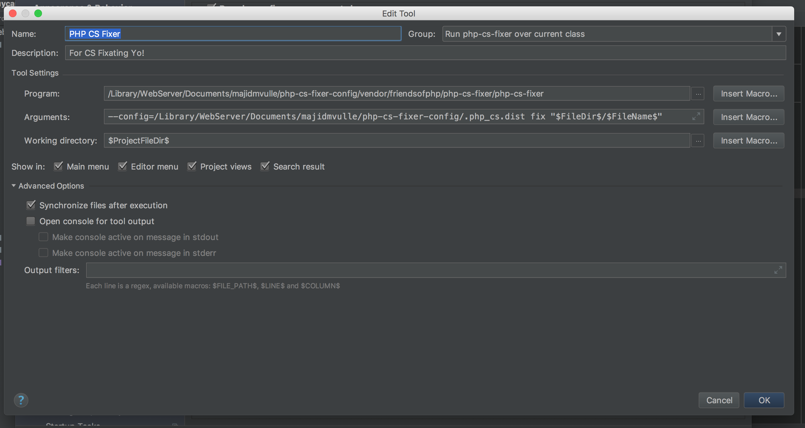
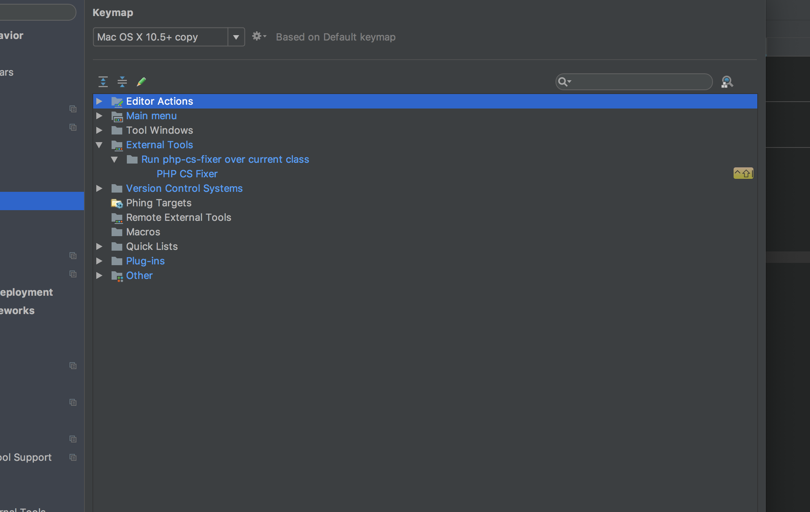

A configuration for php-cs-fixer using Symfony and Laravel rules.

## PhpStorm

### Configuration
To configure in PhpStorm, clone the repository locally and add as an external tool as below.

### Shortcut
To add a PhpStorm shortcut, add the shortcut as below.

### Settings
You may use the [settings.jar](phpstorm/settings.jar) for some other PhpStorm preferences.
 
 

**Enjoy**
